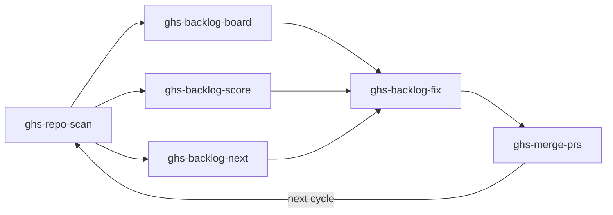
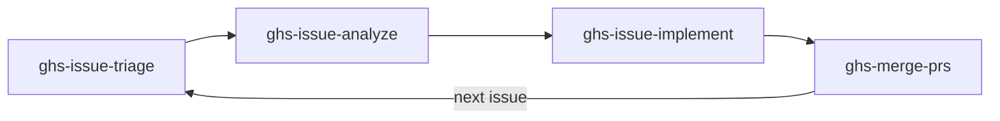

# GitHubSkills

> **Your repos deserve better. GHS fixes them.**

[](LICENSE)
[](#)

A collection of [Claude Code](https://docs.anthropic.com/en/docs/claude-code) skills that audit, manage, and improve your GitHub repositories — automatically.

---

## Table of Contents

- [Overview](#overview)
- [Skills](#skills)
  - [Health Loop](#health-loop)
  - [Issue Loop](#issue-loop)
- [Workflows](#workflows)
- [Prerequisites](#prerequisites)
- [Quick Start](#quick-start)
- [License](#license)

## Overview

GHS provides two automated loops that keep your repositories healthy:

1. **Health Loop** — Scan repos for best-practice violations, prioritize fixes, apply them in parallel, and merge the results.
2. **Issue Loop** — Triage incoming issues, analyze root causes, implement fixes, and merge PRs.

Both loops are driven by natural-language triggers inside Claude Code.

## Skills

### Health Loop

*scan -> board / score / next -> fix -> merge*

| Skill | Description |
|-------|-------------|
| `ghs-repo-scan` | Scan a repository for quality best practices and open issues, produce a scored report |
| `ghs-backlog-board` | Show a dashboard of all backlog items across audited repos with scores and progress |
| `ghs-backlog-score` | Calculate and display the health score for a repository |
| `ghs-backlog-next` | Recommend the highest-impact next item to fix |
| `ghs-backlog-fix` | Apply backlog item fixes using parallel worktree-based agents, create PRs |
| `ghs-merge-prs` | Merge open PRs with CI-aware confirmation and batch support |

### Issue Loop

*triage -> analyze -> implement -> merge*

| Skill | Description |
|-------|-------------|
| `ghs-issue-triage` | Verify and apply proper labels to GitHub issues |
| `ghs-issue-analyze` | Deep-analyze a GitHub issue and post a structured analysis comment |
| `ghs-issue-implement` | Implement a GitHub issue using worktree-based agents, create a PR |
| `ghs-merge-prs` | Merge open PRs with CI-aware confirmation and batch support |

## Workflows

### Health Loop



### Issue Loop



## Prerequisites

| Tool | Purpose |
|------|---------|
| [Claude Code](https://docs.anthropic.com/en/docs/claude-code) | AI coding agent that runs the skills |
| [`gh` CLI](https://cli.github.com/) | GitHub API interactions (must be authenticated) |

## Quick Start

1. **Clone** this repository:
   ```bash
   git clone https://github.com/Atypical-Consulting/GitHubSkills.git
   ```

2. **Open** the project in Claude Code:
   ```bash
   cd GitHubSkills
   claude
   ```

3. **Run** your first scan:
   ```
   scan my repo
   ```

   Claude Code will pick up the `ghs-repo-scan` skill automatically and audit the target repository.

## License

This project is licensed under the [MIT License](LICENSE).
