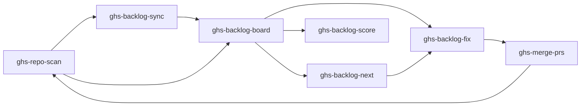
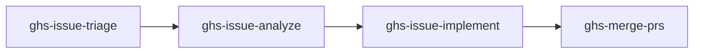

# Core Concepts

## Skills

GHS is a collection of **18 Claude Code skills**. Skills are markdown files in `.claude/skills/` that define how Claude Code performs specific tasks. Each skill has a name, trigger phrases, allowed tools, and a structured process.

You invoke skills with natural language. Saying "scan my repo" triggers `ghs-repo-scan`. Saying "fix the backlog" triggers `ghs-backlog-fix`. Claude Code matches your intent to the right skill automatically.

## The Health Loop

The primary workflow is a continuous improvement cycle for repository quality:



1. **Scan** — `ghs-repo-scan` audits the repo against 40+ core checks (plus language-specific modules) and saves findings as backlog items
2. **Sync** (optional) — `ghs-backlog-sync` publishes findings as GitHub Issues for team visibility
3. **Review** — `ghs-backlog-board` shows a dashboard of all findings with scores and progress
4. **Fix** — `ghs-backlog-fix` spawns parallel agents to fix failing items and create PRs (auto-closes synced issues)
5. **Merge** — `ghs-merge-prs` merges the PRs with CI awareness and branch cleanup
6. **Repeat** — Re-scan to verify fixes and catch any new issues

## The Issue Loop

A separate workflow handles GitHub issue management:



1. **Triage** — `ghs-issue-triage` classifies issues with type, priority, and status labels
2. **Analyze** — `ghs-issue-analyze` investigates the codebase and posts a structured analysis comment
3. **Implement** — `ghs-issue-implement` spawns agents to write code and create PRs
4. **Merge** — `ghs-merge-prs` lands the implementation PRs

## Backlog

The backlog is a structured set of markdown files that track health check results and GitHub issues for each audited repository. It lives in the `backlog/` directory:

```
backlog/
  {owner}_{repo}/
    SUMMARY.md           # Scores, progress, tables
    health/              # Core module findings
      tier-1--readme.md
      tier-2--ci-cd.md
    dotnet/              # .NET module findings (if detected)
      tier-1--dotnet-build-props.md
      tier-2--dotnet-nullable.md
    issues/
      issue-42--title.md # One file per open issue
```

Each backlog item has metadata (tier, points, status, module, category) and acceptance criteria. The status field tracks progress: `FAIL` means unfixed, `PASS` means resolved, `WARN` means permission-blocked. Core module items go in `health/`, language module items go in their own directory (e.g., `dotnet/`).

## Modules

GHS uses a **modular check system**. A **core module** (40 checks) always runs, and **language-specific modules** activate based on stack detection:

| Module | Activation | Checks | Max Points |
|--------|------------|--------|------------|
| Core | Always | 40 scored + 3 INFO | 74 |
| .NET | `.sln` in repo root | 20 scored + 3 INFO | 34 |

Future modules (Python, Node, Go, Rust) follow the same pattern.

## Tiers and Scoring

Each module uses a 3-tier scoring system:

| Tier | Label | Points Each |
|------|-------|-------------|
| 1 | Required | 4 |
| 2 | Recommended | 2 |
| 3 | Nice to Have | 1 |

**Scoring rules:**

- **PASS** items earn their full point value
- **FAIL** items earn zero points
- **WARN** items are excluded from both earned and possible totals (they indicate permission issues, not real failures)
- **INFO** items carry no points and do not affect the score
- **Percentage** = earned points / possible points x 100, rounded to the nearest integer

### Multi-module scoring

When a language module is active, scores are combined with weighted averaging:

```
Combined score = core_pct x 60% + language_pct x 40%
```

If no language module is active, the core score is used at 100% weight. This weighting ensures core repository standards are always the primary driver of the health score.

The tier system ensures that fundamental requirements (Tier 1) are weighted more heavily than nice-to-have polish (Tier 3). A repo missing a README loses 4 points, while a repo missing a FUNDING.yml loses nothing.

## Worktrees

GHS uses **git worktrees** to fix multiple issues in parallel. A worktree is a linked working tree that shares the same `.git` directory as the main clone but has its own branch and working directory.

When `ghs-backlog-fix` or `ghs-issue-implement` runs:

1. The repo is cloned once to `repos/{owner}_{repo}/`
2. Each fix item gets its own worktree at `repos/{owner}_{repo}--worktrees/{branch}/`
3. Each worktree has a dedicated branch (e.g., `fix/license`, `feat/42-dark-mode`)
4. Parallel agents work independently in their worktrees
5. Each agent commits, pushes, and creates a PR
6. Worktrees are cleaned up after the agents finish

This approach avoids branch switching conflicts and allows true parallel execution.

## Orchestration

Beyond the individual loops, GHS provides two orchestration skills that chain everything together:

- **ghs-orchestrate** --- runs a full maintenance pipeline across multiple repos (pull, scan, fix, review, merge, sync, release) with human checkpoints and STATE.md-based resume
- **ghs-dev-loop** --- acts as an autonomous developer for a single repo, processing issues in priority order through the full lifecycle (triage, analyze, implement, review, merge) with budget-constrained cycles

Both orchestration skills delegate all work to the individual skills above --- they never modify code directly.

## Categories

Fix items are classified into categories that determine how they are processed:

| Category | Description | Worktree? | Example |
|----------|-------------|-----------|---------|
| **A** | API-only fixes — no file changes needed | No | Setting repo description, enabling delete-branch-on-merge |
| **B** | File changes — each gets its own worktree and branch | Yes | Adding a LICENSE file, creating .editorconfig |
| **CI** | Special CI diagnosis — needs investigation before fixing | Yes | Diagnosing and fixing failing CI workflows |

Category A items are handled by a single agent that makes `gh` API calls. Category B items each get their own worktree and agent. Category CI items require a diagnostic phase before the fix phase, so they get special handling.

Issue items (from `issues/`) are always Category B, since implementing an issue always involves file changes.
