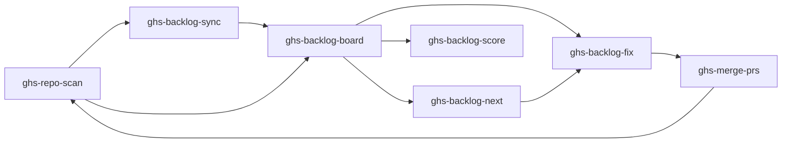
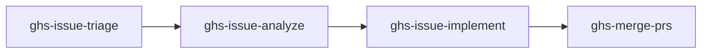

# Core Concepts

## Skills

GHS is a collection of **10 Claude Code skills**. Skills are markdown files in `.claude/skills/` that define how Claude Code performs specific tasks. Each skill has a name, trigger phrases, allowed tools, and a structured process.

You invoke skills with natural language. Saying "scan my repo" triggers `ghs-repo-scan`. Saying "fix the backlog" triggers `ghs-backlog-fix`. Claude Code matches your intent to the right skill automatically.

## The Health Loop

The primary workflow is a continuous improvement cycle for repository quality:



1. **Scan** — `ghs-repo-scan` audits the repo against 38 checks and saves findings as backlog items
2. **Sync** (optional) — `ghs-backlog-sync` publishes findings as GitHub Issues for team visibility
3. **Review** — `ghs-backlog-board` shows a dashboard of all findings with scores and progress
4. **Fix** — `ghs-backlog-fix` spawns parallel agents to fix failing items and create PRs (auto-closes synced issues)
5. **Merge** — `ghs-merge-prs` merges the PRs with CI awareness and branch cleanup
6. **Repeat** — Re-scan to verify fixes and catch any new issues

## The Issue Loop

A separate workflow handles GitHub issue management:



1. **Triage** — `ghs-issue-triage` classifies issues with type, priority, and status labels
2. **Analyze** — `ghs-issue-analyze` investigates the codebase and posts a structured analysis comment
3. **Implement** — `ghs-issue-implement` spawns agents to write code and create PRs
4. **Merge** — `ghs-merge-prs` lands the implementation PRs

## Backlog

The backlog is a structured set of markdown files that track health check results and GitHub issues for each audited repository. It lives in the `backlog/` directory:

```
backlog/
  {owner}_{repo}/
    SUMMARY.md           # Scores, progress, tables
    health/
      tier-1--readme.md  # One file per failing check
      tier-2--ci-cd.md
    issues/
      issue-42--title.md # One file per open issue
```

Each backlog item has metadata (tier, points, status, category) and acceptance criteria. The status field tracks progress: `FAIL` means unfixed, `PASS` means resolved, `WARN` means permission-blocked.

## Tiers and Scoring

GHS uses a 3-tier scoring system with a maximum of **67 points**:

| Tier | Label | Checks | Points Each | Subtotal |
|------|-------|--------|-------------|----------|
| 1 | Required | 4 | 4 | 16 |
| 2 | Recommended | 20 | 2 | 40 |
| 3 | Nice to Have | 11 scored + 3 INFO | 1 | 11 |

**Scoring rules:**

- **PASS** items earn their full point value
- **FAIL** items earn zero points
- **WARN** items are excluded from both earned and possible totals (they indicate permission issues, not real failures)
- **INFO** items carry no points and do not affect the score
- **Percentage** = earned points / possible points * 100, rounded to the nearest integer

The tier system ensures that fundamental requirements (Tier 1) are weighted more heavily than nice-to-have polish (Tier 3). A repo missing a README loses 4 points, while a repo missing a FUNDING.yml loses nothing.

## Worktrees

GHS uses **git worktrees** to fix multiple issues in parallel. A worktree is a linked working tree that shares the same `.git` directory as the main clone but has its own branch and working directory.

When `ghs-backlog-fix` or `ghs-issue-implement` runs:

1. The repo is cloned once to `repos/{owner}_{repo}/`
2. Each fix item gets its own worktree at `repos/{owner}_{repo}--worktrees/{branch}/`
3. Each worktree has a dedicated branch (e.g., `fix/license`, `feat/42-dark-mode`)
4. Parallel agents work independently in their worktrees
5. Each agent commits, pushes, and creates a PR
6. Worktrees are cleaned up after the agents finish

This approach avoids branch switching conflicts and allows true parallel execution.

## Categories

Fix items are classified into categories that determine how they are processed:

| Category | Description | Worktree? | Example |
|----------|-------------|-----------|---------|
| **A** | API-only fixes — no file changes needed | No | Setting repo description, enabling delete-branch-on-merge |
| **B** | File changes — each gets its own worktree and branch | Yes | Adding a LICENSE file, creating .editorconfig |
| **CI** | Special CI diagnosis — needs investigation before fixing | Yes | Diagnosing and fixing failing CI workflows |

Category A items are handled by a single agent that makes `gh` API calls. Category B items each get their own worktree and agent. Category CI items require a diagnostic phase before the fix phase, so they get special handling.

Issue items (from `issues/`) are always Category B, since implementing an issue always involves file changes.
