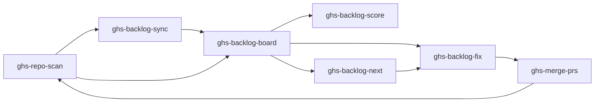
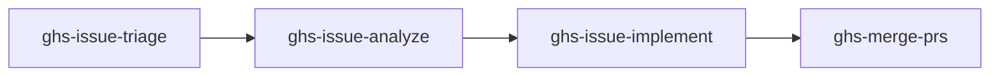

# Skills Reference

GHS provides **12 skills** organized into two workflow loops, a profile viewer, and action skills.

::: tip Start Here
New to GHS? Start with [ghs-repo-scan](/skills/ghs-repo-scan) — it's the entry point for everything else.
:::

## Health Loop

The health loop audits repositories against 43 quality checks, optionally syncs findings to GitHub Issues for team visibility, displays findings on a dashboard, fixes them with parallel agents, and merges the resulting PRs.

## Issue Loop

The issue loop classifies GitHub issues with labels, investigates the codebase for each issue, implements fixes with worktree-based agents, and merges the PRs.

## All Skills

| Skill | Loop | Version | Description |
|-------|------|---------|-------------|
| [ghs-repo-scan](/skills/ghs-repo-scan) | <Badge type="health" text="Health" /> | 6.0.0 | Scan a repo for quality best practices and open issues |
| [ghs-backlog-sync](/skills/ghs-backlog-sync) | <Badge type="health" text="Health" /> | 3.0.0 | Sync health findings to GitHub Issues for team visibility |
| [ghs-backlog-board](/skills/ghs-backlog-board) | <Badge type="health" text="Health" /> | 5.0.0 | Dashboard of all backlog items across audited repos |
| [ghs-backlog-fix](/skills/ghs-backlog-fix) | <Badge type="health" text="Health" /> | 7.0.0 | Fix backlog items using parallel worktree agents |
| [ghs-backlog-score](/skills/ghs-backlog-score) | <Badge type="health" text="Health" /> | 4.0.0 | Calculate and display health score |
| [ghs-backlog-next](/skills/ghs-backlog-next) | <Badge type="health" text="Health" /> | 4.0.0 | Recommend highest-impact next fix |
| [ghs-profile](/skills/ghs-profile) | <Badge type="info" text="Profile" /> | 2.0.0 | 360-degree view of a GitHub user's presence |
| [ghs-issue-triage](/skills/ghs-issue-triage) | <Badge type="issue" text="Issue" /> | 4.0.0 | Apply proper labels to GitHub issues |
| [ghs-issue-analyze](/skills/ghs-issue-analyze) | <Badge type="issue" text="Issue" /> | 4.0.0 | Deep-analyze an issue, post analysis comment |
| [ghs-issue-implement](/skills/ghs-issue-implement) | <Badge type="issue" text="Issue" /> | 4.0.0 | Implement an issue, create a PR |
| [ghs-action-fix](/skills/ghs-action-fix) | <Badge type="action" text="Action" /> | 2.0.0 | Fix failing GitHub Actions pipelines directly |
| [ghs-merge-prs](/skills/ghs-merge-prs) | <Badge type="action" text="Both" /> | 4.0.0 | Merge PRs with CI-aware confirmation |
