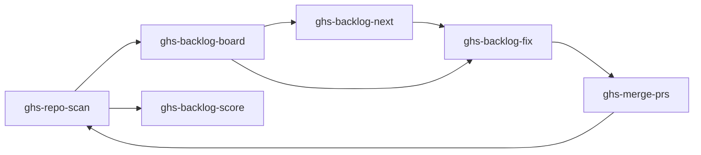

# Health Loop

The Health Loop is GHS's core workflow for improving repository quality through continuous scanning and fixing.

## The Loop



## Step by Step

### 1. Scan
"Scan my repo" --- runs 38 health checks + fetches open issues. Produces a scored report and saves findings as backlog items.

### 2. Review
"Show me the backlog board" --- see all audited repos, their scores, and outstanding items. Or "what's the score?" for a quick number.

### 3. Prioritize
"What should I fix next?" --- GHS recommends the highest-impact item using: lowest-score repo, then health over issues, then lowest tier, then highest points.

### 4. Fix
"Fix the backlog" --- parallel agents create worktrees, fix items, and create pull requests. Items are categorized:
- **Category A**: API-only (repo settings) --- no worktree needed
- **Category B**: File changes --- one worktree per item
- **Category CI**: CI diagnosis --- special handling

### 5. Merge
"Merge my PRs" --- sequentially merges open PRs with CI-aware checks. Bot PRs get squashed, human PRs get regular merge.

### 6. Repeat
Rescan to measure improvement. Target: 100% score (67/67 points).

## Example Session

A realistic conversation flow:

```
You: scan phmatray/my-project
GHS: [scan output with score 45/67 (67%)]

You: what should I fix next?
GHS: [recommends "Repository description is empty" - Tier 1, 4 points]

You: fix the backlog
GHS: [creates PRs for failing items]

You: merge my PRs
GHS: [merges 5 PRs]

You: scan phmatray/my-project
GHS: [new score 62/67 (93%)]
```
