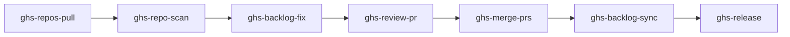
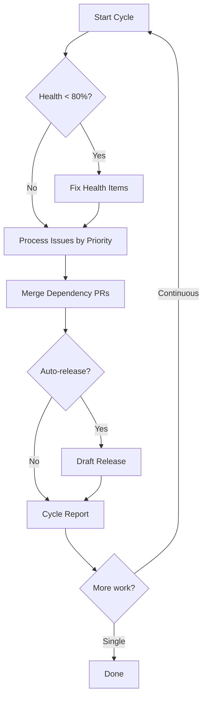

# Orchestration

GHS provides two orchestration skills for automated, end-to-end workflows that chain individual skills together.

## Multi-Repo Pipeline (ghs-orchestrate)

Chain skills into a sequential pipeline across one or many repositories:



### When to Use

- You manage multiple repositories and want to maintain them all in one session
- You want a full end-to-end cycle: scan, fix, review, merge, sync, and release
- You need resume-from-interruption support for long-running maintenance

### Key Features

- **7-stage pipeline**: pull, scan, fix, review, merge, sync, release
- **Human checkpoints**: Pause for confirmation before destructive stages (fix, merge, release)
- **STATE.md resume**: Pick up where you left off if interrupted
- **Dry-run mode**: Preview what would happen without executing
- **Partial ranges**: Run only specific stages with `--from` / `--to`

### Example Session

```
You: maintain my repos
GHS: [shows pipeline plan for 3 repos, asks confirmation]

You: y
GHS: [pulls all repos]
GHS: [scans repo 1: 8 FAIL items]
GHS: ## Checkpoint: Fix Stage --- repo 1
     8 items to fix. This will create PRs. Proceed? (y/n/skip)

You: y
GHS: [fixes 5 items, creates 3 PRs]
GHS: [reviews 3 PRs]
GHS: ## Checkpoint: Merge Stage --- repo 1
     3 PRs approved. Proceed? (y/n/skip)

You: y
GHS: [merges 3 PRs, syncs remaining items]
GHS: [moves to repo 2...]
```

## Single-Repo Developer (ghs-dev-loop)

Act as an autonomous developer for one repository, processing work in priority-driven cycles:



### When to Use

- You want GHS to handle everything for a single repository
- You have a backlog of issues and want them triaged, analyzed, implemented, and merged
- You want priority-based processing: critical bugs before features, health before issues

### Key Features

- **Priority queue**: P0 (critical health) through P6 (release), processed in order
- **3 cycle modes**: single (one pass), continuous (until empty), watch (poll for new issues)
- **Budget control**: Limit issues processed per cycle (default: 5)
- **4 checkpoint gates**: health fix, implement (High+), merge, release
- **Circuit breaker**: 3 failed implementations stops the cycle

### Example Session

```
You: dev loop on phmatray/Formidable
GHS: [pre-flight checks, loads STATE.md]
GHS: ## Priority Queue --- phmatray/Formidable
     Health Score: 65% (P2 maintenance needed)
     Open Issues: 7 (1 critical, 2 high, 4 normal)
     Bot PRs: 3 pending
     Mode: single (budget: 5 issues/cycle)
     Proceed? (y/n/adjust)

You: y
GHS: [fixes health: 65% -> 82%]
GHS: [processes critical issue #12: analyze -> implement -> review -> merge]
GHS: [processes high issue #15: analyze -> implement -> review -> merge]
GHS: ## Checkpoint: Implement #18
     Complexity: VeryHigh. Proceed? (y/skip)

You: skip
GHS: [skips #18, processes normal issue #22]
GHS: [merges 3 Renovate PRs]
GHS: ## Cycle Summary
     Health: 65% -> 82% (+17%)
     Issues: 4 processed, 3 merged, 1 deferred
     PRs: 3 created, 8 merged
```

## Comparison

| Feature | ghs-orchestrate | ghs-dev-loop |
|---------|----------------|--------------|
| Scope | Multi-repo | Single-repo |
| Focus | Health pipeline | Full issue lifecycle |
| Issue processing | No | Yes (triage, analyze, implement) |
| Code review | Yes | Yes |
| Priority queue | No (sequential stages) | Yes (P0-P6) |
| Resume | STATE.md per repo | STATE.md per cycle |
| Modes | Single run | Single, continuous, watch |
| Budget | N/A | Configurable per cycle |
